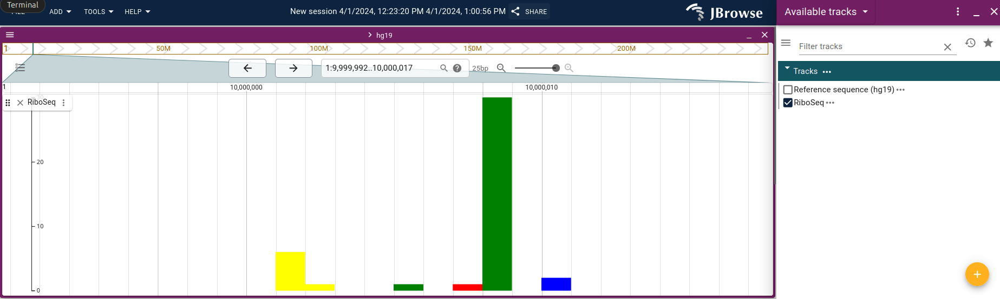

# jbrowse-plugin-riboseq

## Dev setup

```bash

git clone git@github.com:cmdcolin/jbrowse-plugin-riboseq
cd jbrowse-plugin-riboseq
yarn
yarn start
# visit http://yourjbrowse/?config=http://localhost:9000/config.json

```

## Production setup

```json
{
  "plugins": {
    "url": "http"
  }
}
```

## Screenshot



## Input

sample data: a bed tabix file with a column name indicating "color"

```
#chr	start	end	strand	color	count
1	10000000	10000001	+	0	6
1	10000001	10000002	+	0	1
1	10000004	10000005	+	1	1
1	10000006	10000007	+	2	1
1	10000007	10000008	+	1	30
1	10000009	10000010	+	3	2
```

## Configuration

Use the RiboSeqAdapter and then use a BedTabixAdapter subadapter

```json
{
  "type": "FeatureTrack",
  "trackId": "riboseq_track",
  "name": "RiboSeq",
  "assemblyNames": ["hg19"],
  "adapter": {
    "type": "RiboSeqAdapter",
    "subadapter": {
      "type": "BedTabixAdapter",
      "scoreColumn": "count",
      "bedGzLocation": {
        "uri": "test.bed.gz"
      },
      "index": {
        "location": {
          "uri": "test.bed.gz.tbi"
        }
      }
    }
  },
  "displays": [
    {
      "displayId": "riboseq_display",
      "type": "LinearRiboSeqDisplay"
    }
  ]
}
```
